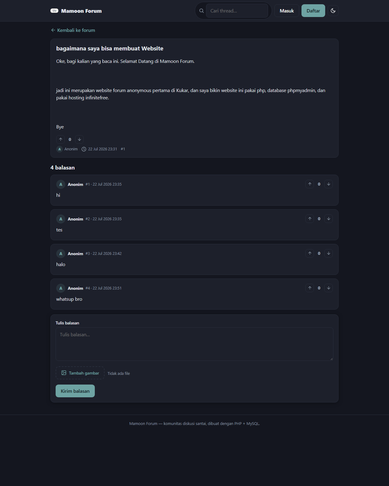
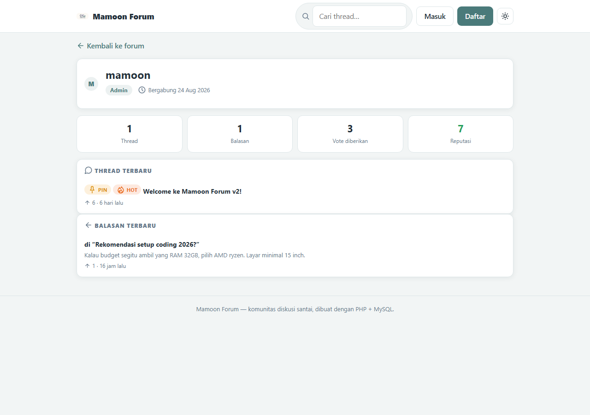
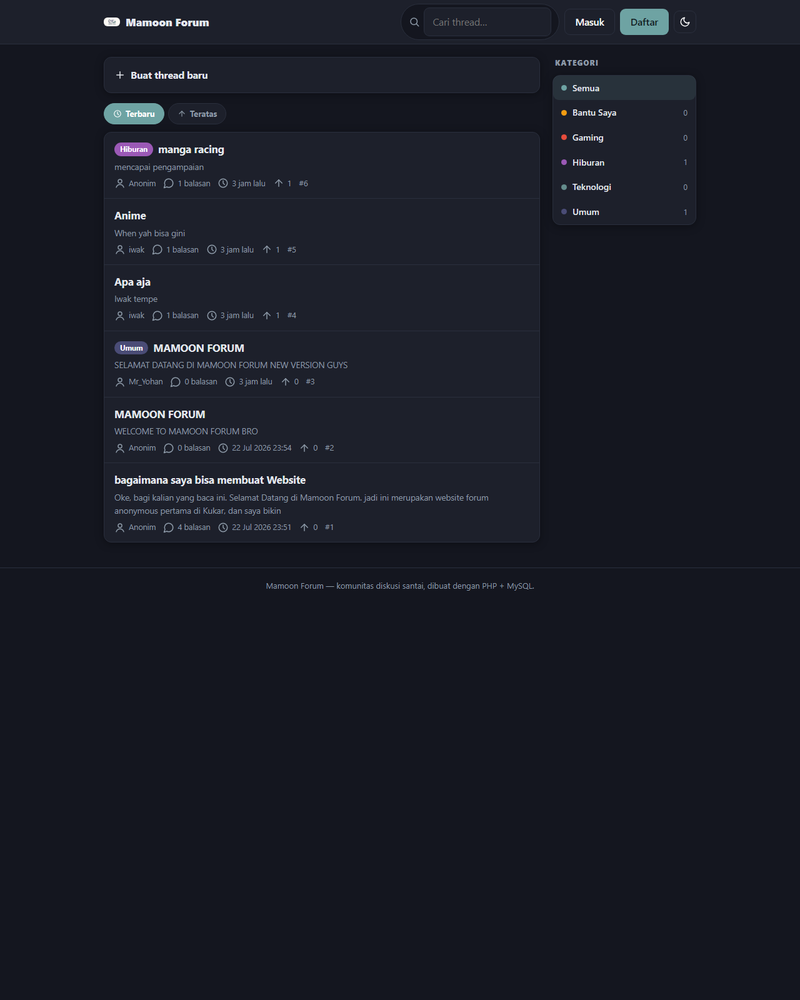

# Mamoon Forum

Forum diskusi ringan berbasis PHP murni dan MySQL, dengan dukungan posting anonim maupun akun terdaftar. Tanpa framework, tanpa build step, tanpa CDN eksternal - setiap halaman berukuran puluhan kilobyte dan tetap cepat di shared hosting.

   

## Tangkapan Layar

| Halaman utama | Detail thread |
| --- | --- |
|  |  |

| Profil pengguna | Mode gelap |
| --- | --- |
|  |  |

## Fitur

- **Posting anonim atau akun terdaftar** - forum tetap berfungsi penuh tanpa login; akun hanya diperlukan untuk voting, avatar, dan moderasi.
- **Kategori thread** - pengelompokan diskusi dengan warna dan penghitung thread.
- **Pencarian** - pencarian judul dan isi thread langsung dari navbar.
- **Sticky dan locked thread** - pin thread penting, kunci diskusi yang selesai.
- **Voting thread dan balasan** - upvote/downvote dengan toggle (klik ulang membatalkan) dan switch (pindah arah); satu vote per pengguna per target, dijaga unique key di level database.
- **Pengurutan Terbaru / Teratas** - tab urutan berdasarkan waktu aktif atau skor vote.
- **Badge Hot** - thread dengan skor vote di atas ambang batas (dapat dikonfigurasi) ditandai otomatis.
- **Reputasi** - akumulasi skor vote dari seluruh thread dan balasan milik pengguna, dihitung langsung dari data vote.
- **Halaman profil** - statistik aktivitas beserta thread dan balasan terbaru.
- **Edit profil** - ganti avatar (dikompres otomatis menjadi maksimal 256px) dan ganti password.
- **Edit thread dan balasan** - pembuat dapat mengubah judul, isi, dan gambarnya; perubahan ditandai "(diedit)". Moderator dapat mengedit semua konten.
- **Pagination** - 20 thread per halaman, 15 balasan per halaman.
- **Kompresi gambar otomatis** - unggahan di-resize menjadi maksimal 1280px dan disimpan sebagai WebP/JPEG, umumnya puluhan KB.
- **Tema terang dan gelap** - mengikuti preferensi sistem, tersimpan di localStorage.
- **Notifikasi toast** - umpan balik sukses/gagal tanpa dialog bawaan browser.

## Persyaratan

- PHP 7.4 atau lebih baru dengan ekstensi `mysqli`, `gd`, `mbstring`, dan `fileinfo`
- MySQL 5.7 / MariaDB 10.4 atau lebih baru
- Apache dengan `mod_rewrite` (opsional, untuk gzip dan header cache) atau server web lain

## Instalasi

1. Salin proyek ke folder web server:

   ```bash
   git clone https://github.com/mahakammoonlightstudio-beep/mamoon-forum.git
   ```

2. Buat database dan impor skema:

   ```bash
   mysql -u USER -p NAMA_DATABASE < database/schema.sql
   ```

   Untuk memutakhirkan database dari versi sebelumnya, jalankan pula `database/upgrade.sql`, `database/upgrade-votes.sql`, dan `database/upgrade-edit.sql`. Ketiganya aman terhadap data yang sudah ada.

3. Salin konfigurasi dan sesuaikan kredensial:

   ```bash
   cp config.example.php config.php
   ```

   Isi `DB_HOST`, `DB_USER`, `DB_PASS`, dan `DB_NAME`. Berkas `config.php` telah terdaftar di `.gitignore` dan tidak boleh ikut ke repositori.

4. Pastikan folder `uploads/` dapat ditulisi oleh PHP. Folder dan berkas `.htaccess` pelindungnya sudah disertakan di repositori.

5. (Opsional, untuk pengujian lokal) Isi data contoh:

   ```bash
   mysql -u USER -p NAMA_DATABASE < database/seed-demo.sql
   ```

   Seluruh akun demo menggunakan password `password123`. Berkas ini menghapus data pada tabel utama dan hanya untuk lingkungan pengembangan.

## Menjalankan secara lokal

PHP bawaan cukup untuk pengembangan:

```bash
php -S localhost:8000
```

Pengguna Herd (macOS/Windows) dapat memakai biner PHP yang terpasang, misalnya `~/.config/herd/bin/php84/php.exe` pada Windows.

## Struktur Proyek

```
mamoon-forum/
├── index.php              # Daftar thread (kategori, pencarian, sort, badge Hot)
├── thread.php             # Detail thread dan balasan
├── post_thread.php        # Handler pembuatan thread
├── post_reply.php         # Handler balasan
├── vote.php               # Endpoint vote (POST)
├── profile.php            # Profil pengguna
├── edit_profile.php       # Ganti avatar dan password
├── edit.php               # Edit thread/balasan oleh pembuatnya
├── mod_thread.php         # Aksi moderator
├── login.php              # Masuk
├── register.php           # Daftar akun
├── logout.php             # Keluar
├── db.php                 # Koneksi database
├── config.example.php     # Contoh konfigurasi
├── assets/
│   ├── style.css          # Seluruh gaya (tema terang/gelap, ~8 KB)
│   └── app.js             # Tema, unggahan, toast (~1.5 KB)
├── lib/
│   ├── helpers.php        # Session, CSRF, rate limit, honeypot
│   ├── auth.php           # Login/daftar/logout, reputasi
│   ├── images.php         # Kompresi gambar via GD
│   ├── votes.php          # Skor vote dan widget voting
│   └── layout.php         # Header/footer dan ikon SVG
├── database/
│   ├── schema.sql         # Skema untuk instalasi baru
│   ├── upgrade.sql        # Pemutakhiran dari basis lama
│   ├── upgrade-votes.sql  # Pemutakhiran untuk fitur voting
│   ├── upgrade-edit.sql   # Pemutakhiran untuk fitur edit konten
│   └── seed-demo.sql      # Data demo (khusus pengembangan)
└── uploads/               # Gambar hasil unggahan
```

## Catatan Keamanan

- Seluruh query menggunakan prepared statements.
- Seluruh output di-escape dengan `htmlspecialchars`.
- Setiap form POST dilindungi CSRF token per sesi.
- Unggahan gambar divalidasi dari isi berkas (bukan ekstensi), diproses ulang melalui GD, dan folder `uploads/` menonaktifkan eksekusi PHP.
- Rate limit per IP untuk pembuatan thread, balasan, vote, login, pendaftaran, dan edit profil.
- Honeypot field untuk menggagalkan spam bot sederhana.
- Password disimpan menggunakan `password_hash()` (bcrypt).
- URL tujuan setelah aksi divalidasi untuk mencegah open redirect.

Disarankan menjalankan forum di atas HTTPS. InfinityFree menyediakan SSL gratis.

## Roadmap

- [x] Voting thread dan balasan
- [x] Pengurutan Terbaru / Teratas
- [x] Reputasi pengguna
- [x] Halaman dan edit profil
- [ ] Balasan bertingkat (nested comments)
- [ ] Panel admin
- [ ] Umpan RSS per kategori

## Kontribusi

Kontribusi dipersilakan melalui fork, branch, dan pull request. Untuk perubahan besar, mohon diskusikan terlebih dahulu melalui issue.

## Lisensi

Didistribusikan di bawah [Lisensi MIT](LICENSE).
